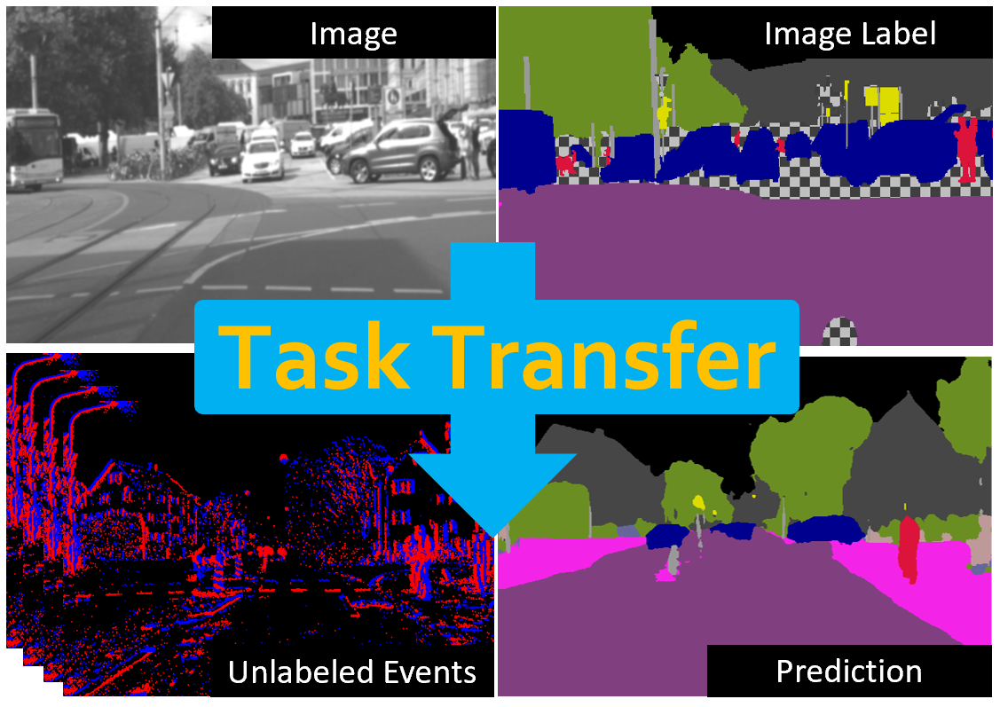

# ESS: Learning Event-based Semantic Segmentation from Still Images

<p align="center">
 <a href="https://youtu.be/Tby5c9IDsDc">
  
 </a>
</p>

This is the code for the paper **ESS: Learning Event-based Semantic Segmentation from Still Images** 
([PDF](https://rpg.ifi.uzh.ch/docs/ECCV22_Sun.pdf)) by Zhaoning Sun*, [Nico Messikommer](https://messikommernico.github.io/)*, [Daniel Gehrig](https://danielgehrig18.github.io), and [Davide Scaramuzza](http://rpg.ifi.uzh.ch/people_scaramuzza.html). For an overview of our method, check out our [video](https://youtu.be/Tby5c9IDsDc).

If you use any of this code, please cite the following publication:

```bibtex
@Article{Sun22eccv,
  author  = {Zhaoning Sun* and Nico Messikommer* and Daniel Gehrig and Davide Scaramuzza},
  title   = {ESS: Learning Event-based Semantic Segmentation from Still Images},
  journal = {European Conference on Computer Vision. (ECCV)},
  year    = {2022},
}
```

## Abstract
Retrieving accurate semantic information in challenging high dynamic range (HDR) and high-speed conditions
remains an open challenge for image-based algorithms due to severe image degradations. Event cameras promise 
to address these challenges since they feature a much higher dynamic range and are resilient to motion blur. 
Nonetheless, semantic segmentation with event cameras is still in its infancy which is chiefly due to the 
novelty of the sensor, and the lack of high-quality, labeled datasets. In this work, we introduce ESS, which 
tackles this problem by directly transferring the semantic segmentation task from existing labeled image 
datasets to unlabeled events via unsupervised domain adaptation (UDA). Compared to existing UDA methods, 
our approach aligns recurrent, motion-invariant event embeddings with image embeddings. For this reason, our 
method neither requires video data nor per-pixel alignment between images and events and, crucially, does not 
need to hallucinate motion from still images. Additionally, to spur further research in event-based semantic 
segmentation, we introduce DSEC-Semantic, the first large-scale event-based dataset with fine-grained labels. 
We show that using image labels alone, ESS outperforms existing UDA approaches, and when combined with event 
labels, it even outperforms state-of-the-art supervised approaches on both DDD17 and DSEC-Semantic. Finally, 
ESS is general-purpose, which unlocks the vast amount of existing labeled image datasets and paves the way 
for new and exciting research directions in new fields previously inaccessible for event cameras.

## Installation

### Dependencies
If desired, a conda environment can be created using the followig command:
```bash
conda create -n <env_name>
```
As an initial step, the wheel package needs to be installed with the following command:
```bash
pip install wheel
```
The required python packages are listed in the `requirements.txt` file.
```bash
pip install -r requirements.txt
```

### Pre-trained E2VID Model
Pre-trained E2VID model needs to be downloaded [here](https://github.com/uzh-rpg/rpg_e2vid) and placed in `/e2vid/pretrained/`.

## Datasets

### DSEC-Semantic
The DSEC-Semantic dataset can be downloaded [here](https://dsec.ifi.uzh.ch/dsec-semantic/). The dataset should have the following format:

    ├── DSEC_Semantic                 
    │   ├── train               
    │   │   ├── zurich_city_00_a
    │   │   │   ├── semantic
    │   │   │   │   ├── left
    │   │   │   │   │   ├── 11classes
    │   │   │   │   │   │   └──data
    │   │   │   │   │   │       ├── 000000.png
    │   │   │   │   │   │       └── ...
    │   │   │   │   │   └── 19classes
    │   │   │   │   │       └──data
    │   │   │   │   │           ├── 000000.png
    │   │   │   │   │           └── ...
    │   │   │   │   └── timestamps.txt
    │   │   │   └── events  
    │   │   │       └── left
    │   │   │           ├── events.h5
    │   │   │           └── rectify_map.h5
    │   │   └── ...
    │   └── test
    │       ├── zurich_city_13_a
    │       │   └── ...
    │       └── ... 

### DDD17
The original DDD17 dataset with semantic segmentation labels can be downloaded [here](https://github.com/Shathe/Ev-SegNet).
Additionally, we provide a pre-processed DDD17 dataset with semantic labels [here](https://download.ifi.uzh.ch/rpg/ESS/ddd17_seg.tar.gz). Please do not forget to cite [DDD17](https://sensors.ini.uzh.ch/news_page/DDD17.html) and [Ev-SegNet](https://github.com/Shathe/Ev-SegNet) if you are using the DDD17 with semantic labels.

### Cityscapes
The Cityscapes dataset can be downloaded [here](https://www.cityscapes-dataset.com/).

## Training
The settings for the training can be specified in `config/settings_XXXX.yaml`.
Two different models can be trained: 
- ess: ESS UDA / ESS supervised (events labels + frames labels)
- ess_supervised: ESS supervised (only events labels)

The following command starts the training:

```bash
CUDA_VISIBLE_DEVICES=<GPU_ID>, python train.py --settings_file config/settings_XXXX.yaml
```

For testing the pre-trained models, please set `load_pretrained_weights=True` and specify the path of pre-trained weights in `pretrained_file`.

## Pre-trained Weights
To download the pre-trained weights for the models on DDD17 and DSEC in the UDA setting, please fill in your details in [this](https://docs.google.com/forms/d/e/1FAIpQLScn5XWvBcmjPoSbaIqEUoEpWeheLGpQTUeK6Pp19wx2jNCPpA/viewform?usp=sf_link) Google Form.

# Acknowledgement
Several network architectures were adapted from:
https://github.com/uzh-rpg/rpg_e2vid

The general training framework was inspired by:
https://github.com/uzh-rpg/rpg_ev-transfer

The DSEC data loader was adapted from:
https://github.com/uzh-rpg/DSEC

The optimizer was adapted from:
https://github.com/LiyuanLucasLiu/RAdam

The DICE loss was adapted from:
https://github.com/Guocode/DiceLoss.Pytorch